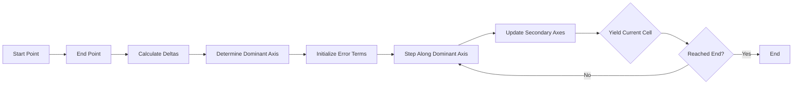
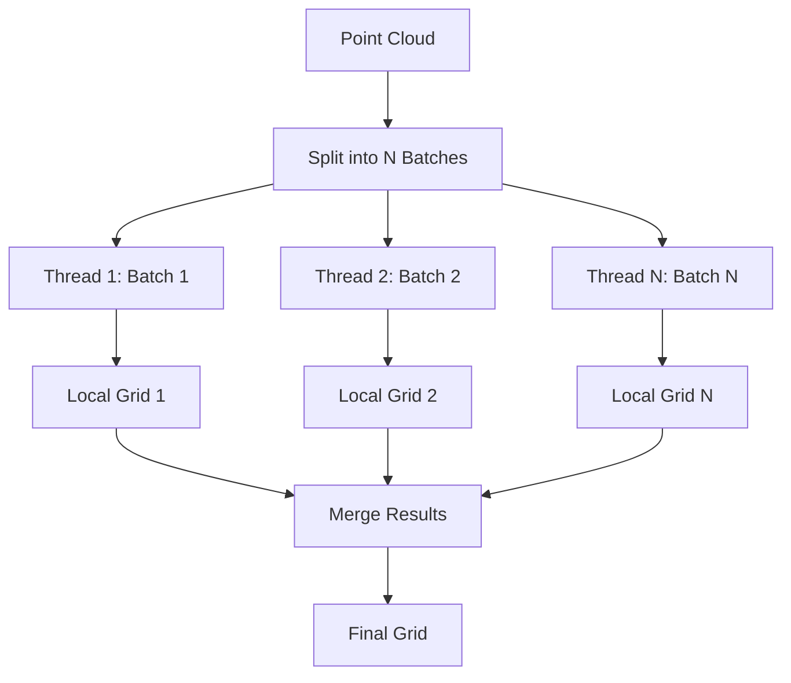

# Main Grid Creation Workflow

This flowchart illustrates the main grid creation workflow implemented in both C++ (`STL_STEPCreateGrid3D::compute()`) and Python (`create_grid_from_points_with_ray_tracing()`).

## Workflow Overview

```mermaid
flowchart TD
    A[Input: Point Cloud + Normals] --> B[Calculate Bounding Box]
    B --> C[Determine Grid Dimensions]
    C --> D[Initialize Empty Grids]
    D --> E[Split Points into Threads]
    E --> F[Multi-threaded Processing]
    
    F --> G[For Each Point Batch]
    G --> H[For Each Point]
    H --> I[Normalize Normal Vector]
    I --> J[Create Two Beams]
    J --> K[Beam 1: Point + Normal]
    J --> L[Beam 2: Point - Normal]
    
    K --> M[Trace Ray 1]
    L --> N[Trace Ray 2]
    
    M --> O[3D Bresenham/Woo Traversal]
    N --> P[3D Bresenham/Woo Traversal]
    
    O --> Q[Fill Grid Cells]
    P --> R[Fill Grid Cells]
    
    Q --> S[Calculate Ray Lengths]
    R --> T[Calculate Ray Lengths]
    
    S --> U[Increment Grid Values]
    T --> V[Increment Grid Values]
    
    U --> W[Next Point]
    V --> W
    W --> X{More Points?}
    X -->|Yes| H
    X -->|No| Y{More Batches?}
    Y -->|Yes| G
    Y -->|No| Z[Merge Thread Results]
    
    Z --> AA[Compute Statistics]
    AA --> BB[Output: Filled Grid + Ray Length Grid]
    
    style A fill:#e1f5fe
    style BB fill:#c8e6c9
    style F fill:#fff3e0
    style O fill:#f3e5f5
    style P fill:#f3e5f5
    
    click A "https://github.com/sfoucher/pluginsteplight/blob/main/pluginsteplight/step/stl_stepcreategrid3d.cpp#L64" "C++: STL_STEPCreateGrid3D::compute()"
    click B "https://github.com/sfoucher/pluginsteplight/blob/main/pluginsteplight/step/stl_stepcreategrid3d.cpp#L95-105" "C++: Bounding box calculation"
    click C "https://github.com/sfoucher/pluginsteplight/blob/main/pluginsteplight/step/stl_stepcreategrid3d.cpp#L107-115" "C++: Grid dimensions"
    click D "https://github.com/sfoucher/pluginsteplight/blob/main/pluginsteplight/step/stl_stepcreategrid3d.cpp#L117-125" "C++: Grid initialization"
    click E "https://github.com/sfoucher/pluginsteplight/blob/main/pluginsteplight/step/stl_stepcreategrid3d.cpp#L127-135" "C++: Thread splitting"
    click F "https://github.com/sfoucher/pluginsteplight/blob/main/pluginsteplight/step/stl_stepcreategrid3d.cpp#L137-175" "C++: Multi-threaded processing"
    click H "https://github.com/sfoucher/pluginsteplight/blob/main/pluginsteplight/step/stl_stepcreategrid3d.cpp#L140-145" "C++: Point iteration"
    click I "https://github.com/sfoucher/pluginsteplight/blob/main/pluginsteplight/step/stl_stepcreategrid3d.cpp#L147-150" "C++: Normal normalization"
    click J "https://github.com/sfoucher/pluginsteplight/blob/main/pluginsteplight/step/stl_stepcreategrid3d.cpp#L152-155" "C++: Beam creation"
    click K "https://github.com/sfoucher/pluginsteplight/blob/main/pluginsteplight/step/stl_stepcreategrid3d.cpp#L157-160" "C++: Beam 1 (positive normal)"
    click L "https://github.com/sfoucher/pluginsteplight/blob/main/pluginsteplight/step/stl_stepcreategrid3d.cpp#L162-165" "C++: Beam 2 (negative normal)"
    click M "https://github.com/sfoucher/pluginsteplight/blob/main/pluginsteplight/stl_grid3dwootraversalalgorithm.cpp#L50" "C++: Woo traversal algorithm"
    click N "https://github.com/sfoucher/pluginsteplight/blob/main/pluginsteplight/stl_grid3dwootraversalalgorithm.cpp#L50" "C++: Woo traversal algorithm"
    click O "https://github.com/sfoucher/pluginsteplight/blob/main/pluginsteplight/stl_grid3dbeamvisitor.cpp#L10" "C++: Beam visitor (grid filling)"
    click P "https://github.com/sfoucher/pluginsteplight/blob/main/pluginsteplight/stl_grid3dbeamvisitor.cpp#L10" "C++: Beam visitor (grid filling)"
    click Q "https://github.com/sfoucher/pluginsteplight/blob/main/pluginsteplight/stl_grid3dbeamvisitor.cpp#L12" "C++: Grid cell increment"
    click R "https://github.com/sfoucher/pluginsteplight/blob/main/pluginsteplight/stl_grid3dbeamvisitor.cpp#L12" "C++: Grid cell increment"
    click S "https://github.com/sfoucher/pluginsteplight/blob/main/pluginsteplight/stl_grid3dwootraversalalgorithm.cpp#L180" "C++: Ray length calculation"
    click T "https://github.com/sfoucher/pluginsteplight/blob/main/pluginsteplight/stl_grid3dwootraversalalgorithm.cpp#L180" "C++: Ray length calculation"
    click U "https://github.com/sfoucher/pluginsteplight/blob/main/pluginsteplight/stl_grid3dbeamvisitor.cpp#L12" "C++: Grid value increment"
    click V "https://github.com/sfoucher/pluginsteplight/blob/main/pluginsteplight/stl_grid3dbeamvisitor.cpp#L12" "C++: Grid value increment"
    click Z "https://github.com/sfoucher/pluginsteplight/blob/main/pluginsteplight/step/stl_stepcreategrid3d.cpp#L177-195" "C++: Thread result merging"
    click AA "https://github.com/sfoucher/pluginsteplight/blob/main/pluginsteplight/step/stl_stepcreategrid3d.cpp#L197-205" "C++: Statistics computation"
    click BB "https://github.com/sfoucher/pluginsteplight/blob/main/pluginsteplight/step/stl_stepcreategrid3d.cpp#L207-225" "C++: Output generation"
```

## Code References

### C++ Implementation
- **Main Function**: [`STL_STEPCreateGrid3D::compute()`](https://github.com/sfoucher/pluginsteplight/blob/main/pluginsteplight/step/stl_stepcreategrid3d.cpp#L64)
- **Woo Traversal**: [`STL_Grid3DWooTraversalAlgorithm`](https://github.com/sfoucher/pluginsteplight/blob/main/pluginsteplight/stl_grid3dwootraversalalgorithm.cpp#L50)
- **Beam Visitor**: [`STL_Grid3DBeamVisitor`](https://github.com/sfoucher/pluginsteplight/blob/main/pluginsteplight/stl_grid3dbeamvisitor.cpp#L10)
- **Grid Class**: [`STL_Grid3D`](https://github.com/sfoucher/pluginsteplight/blob/main/pluginsteplight/stl_grid3d.h)

### Python Implementation
- **Main Function**: [`create_grid_from_points_with_ray_tracing()`](https://github.com/sfoucher/pluginsteplight/blob/main/PythonStep/PythonStep/grid_creation.py#L120)
- **3D Bresenham**: [`bresenham_3d()`](https://github.com/sfoucher/pluginsteplight/blob/main/PythonStep/PythonStep/grid_creation.py#L8)
- **Ray Tracing**: [`_trace_ray_and_fill_grid()`](https://github.com/sfoucher/pluginsteplight/blob/main/PythonStep/PythonStep/grid_creation.py#L60)
- **Multi-threading**: [`_process_point_batch()`](https://github.com/sfoucher/pluginsteplight/blob/main/PythonStep/PythonStep/grid_creation.py#L40)

## Detailed Process Flow

### 1. Input Processing
- **Point Cloud**: 3D coordinates (x, y, z)
- **Normals**: Normal vectors (nx, ny, nz) for each point
- **Parameters**: Grid resolution, padding, number of threads

### 2. Grid Initialization
- Calculate bounding box from point cloud
- Determine grid dimensions based on resolution
- Initialize two empty 3D arrays:
  - `grid_data`: Integer array for vote counting
  - `ray_length_grid`: Float array for ray length accumulation

### 3. Multi-threading Setup
- Split point cloud into batches for parallel processing
- Each thread processes a subset of points independently
- Local grids are created for each thread to avoid race conditions

### 4. Ray Tracing Process
For each point and its normal:
1. **Normalize** the normal vector
2. **Create two beams**:
   - Beam 1: From point along normal direction
   - Beam 2: From point opposite to normal direction
3. **Trace rays** using 3D Bresenham/Woo traversal algorithm
4. **Fill grid cells** along each ray path
5. **Calculate ray lengths** from point to each cell center

### 5. Grid Cell Filling
- **Increment vote count** for each cell visited by a ray
- **Accumulate ray lengths** for distance calculations
- **Handle grid boundaries** to prevent out-of-bounds access

### 6. Result Merging
- Combine results from all threads
- Sum local grids into final grid
- Sum local ray length grids into final ray length grid

### 7. Output Generation
- **Grid Statistics**: Min/max values, nonzero cell count
- **Filled 3D Grid**: Ready for further processing (filtering, analysis)
- **Ray Length Grid**: Distance information for each cell

## Key Algorithms

### 3D Bresenham/Woo Traversal

### Multi-threading Strategy

## Performance Considerations

- **Memory Efficiency**: Local grids prevent memory conflicts
- **Parallel Processing**: Multi-threading for CPU-intensive ray tracing
- **Algorithm Optimization**: 3D Bresenham for efficient grid traversal
- **Boundary Handling**: Proper grid boundary checks

## Applications

The filled grid can be used for:
- **Local Maxima Detection**: Finding peaks in the vote distribution
- **Curve Extraction**: Using active contours or other algorithms
- **Shape Analysis**: Analyzing tubular structures in point clouds
- **Filtering**: Applying various filtering techniques to the grid data 