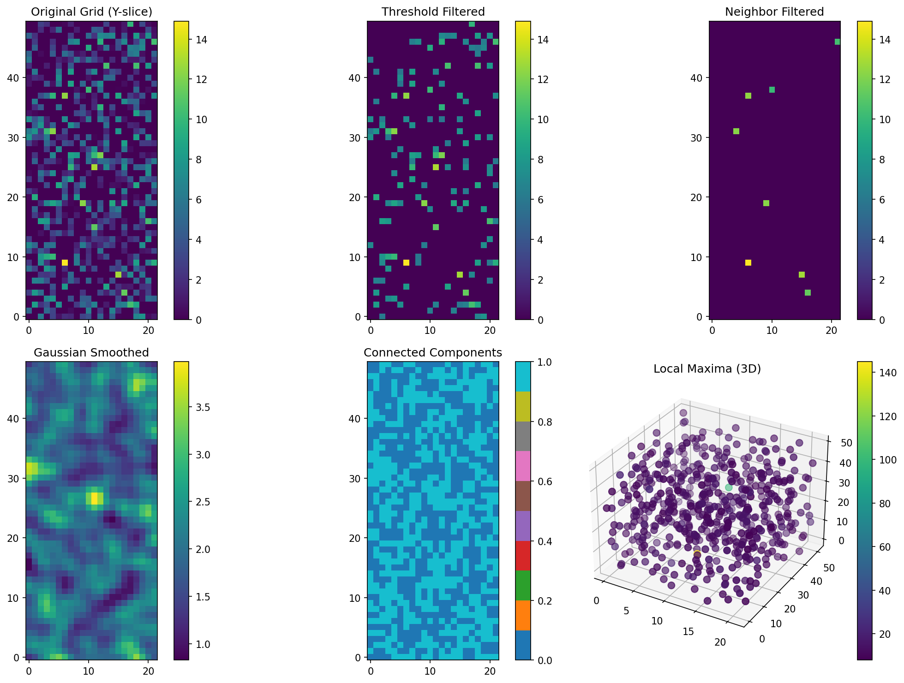
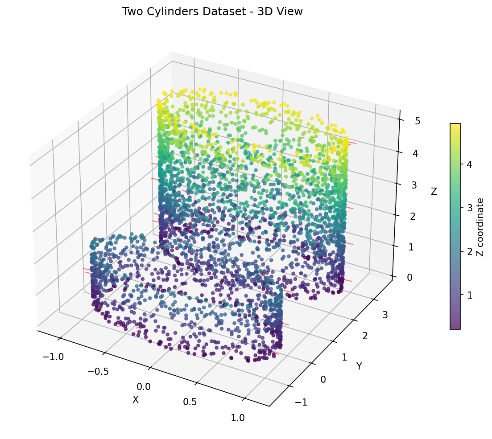
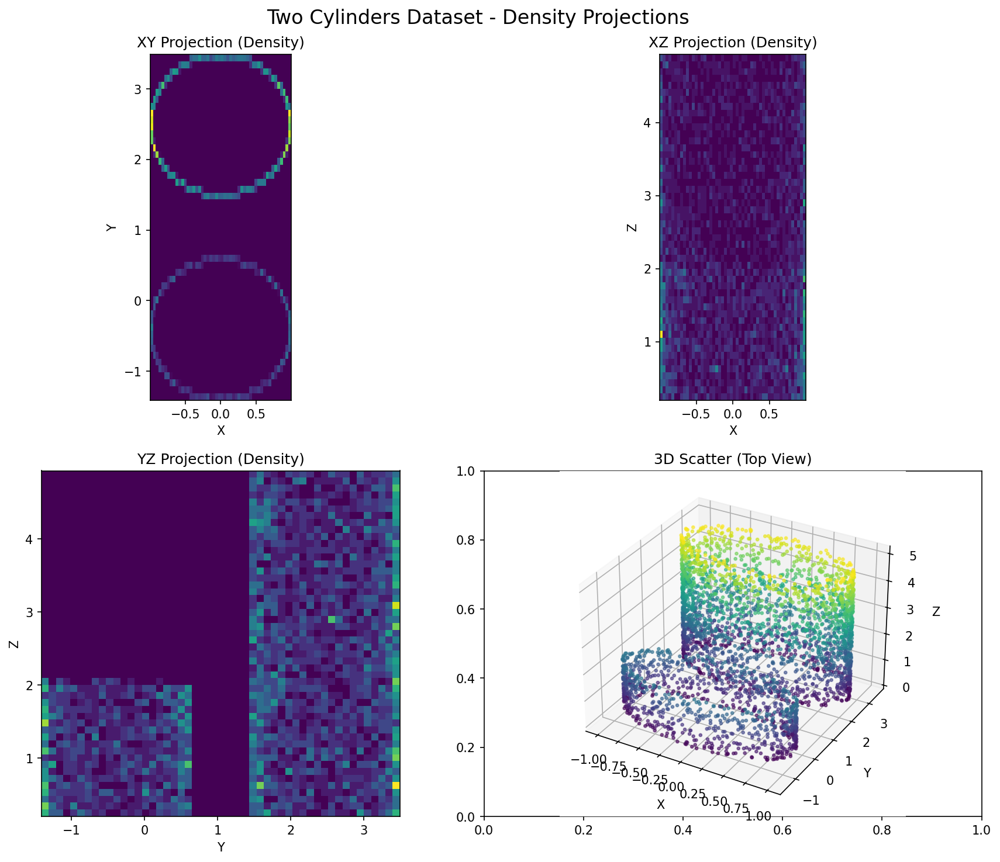
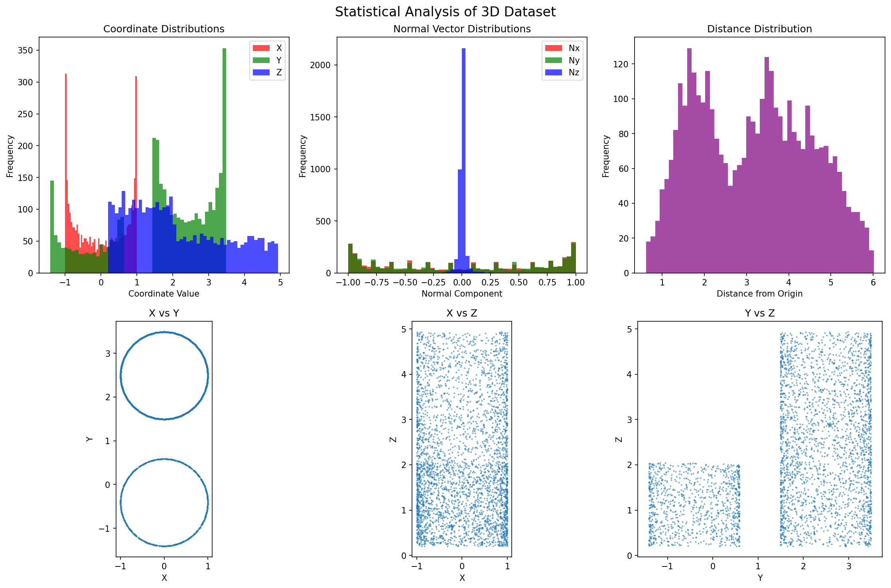
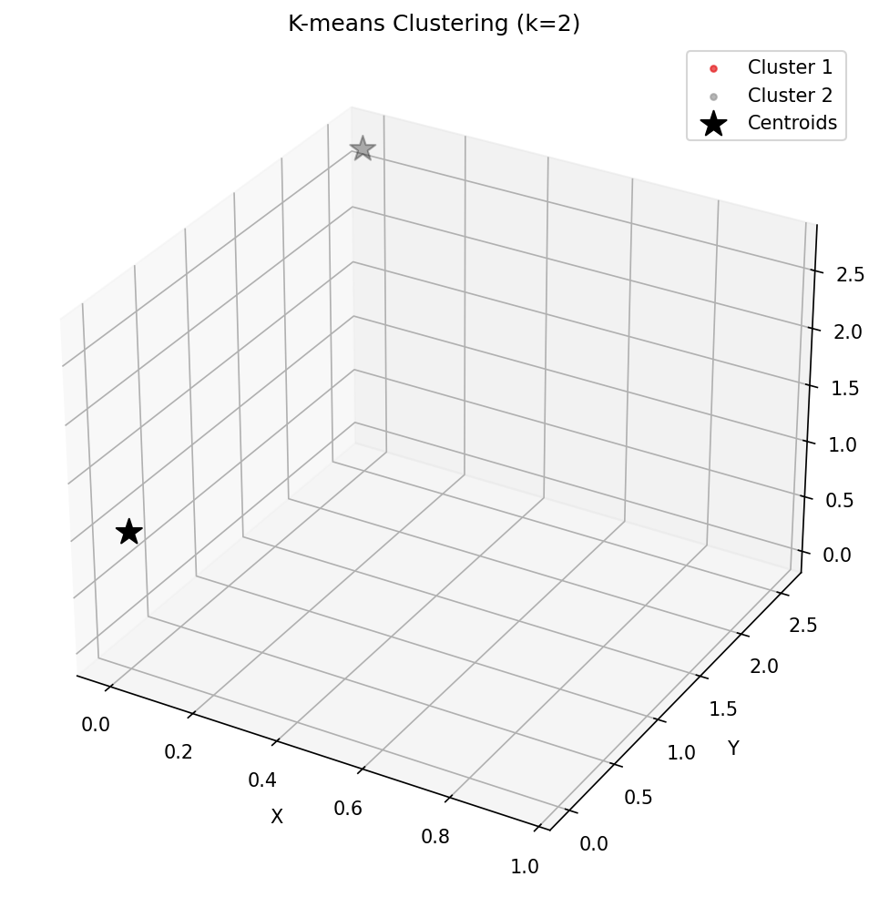

# PythonStep Examples

This directory contains example scripts demonstrating how to use the PythonStep package for 3D point cloud and grid processing workflows. All examples use the sample file `twoCylinders.txt`.

## Example Scripts

### 1. `basic_workflow_example.py`
- **Purpose:** Demonstrates a complete workflow: loading a point cloud, creating a grid, applying filtering and analysis, and visualizing results.
- **Features:**
  - Loads `twoCylinders.txt`
  - Creates a synthetic 3D grid
  - Applies threshold filtering, neighbor-based filtering, local maxima detection, smoothing, and connected components analysis
  - Visualizes results with matplotlib (6-panel figure)
  - **Output:** `workflow_results.png`


*Complete workflow visualization showing original grid, filtered results, and analysis outputs*

### 2. `simple_workflow_example.py`
- **Purpose:** Lightweight version of the workflow for environments without matplotlib.
- **Features:**
  - Same workflow as above, but prints results and saves to text files
  - **Output:**
    - `local_maxima_results.txt`: Coordinates and values of detected peaks
    - `grid_statistics.txt`: Comprehensive grid statistics

### 3. `visualize_3d_dataset.py`
- **Purpose:** Visualizes the 3D dataset in `twoCylinders.txt` using various techniques.
- **Features:**
  - 3D scatter plot of points (with color by Z)
  - 3D scatter plot with normal vectors
  - 2D density projections (XY, XZ, YZ)
  - Statistical visualizations (histograms, scatter plots)
  - K-means clustering visualization
  - Interactive 3D plot (if supported)
  - **Output:**
    - `3d_scatter_plot.png`
    - `density_projections.png`
    - `statistical_analysis.png`
    - `cluster_visualization.png`
    - `interactive_3d_plot.png` (if interactive backend is available)
    - `dataset_summary.txt`

#### Visualization Examples

**3D Scatter Plot with Normal Vectors:**

*3D visualization of the two cylinders dataset with normal vectors*

**Density Projections:**

*2D density projections showing the spatial distribution of points*

**Statistical Analysis:**

*Statistical distributions and coordinate relationships*

**Cluster Visualization:**

*K-means clustering showing the two distinct cylinder clusters*

## Requirements
- Python 3.7+
- numpy
- scipy
- matplotlib

Install requirements with:
```bash
pip install numpy scipy matplotlib
```

## Usage
Run any example from this directory:

```bash
python3 basic_workflow_example.py
python3 simple_workflow_example.py
python3 visualize_3d_dataset.py
```

## Data File
All examples require the file `twoCylinders.txt` to be present at the path `/home/sfoucher/DEV/pluginsteplight/twoCylinders.txt`.

## Output
Each script will generate output files (images, text) in this directory. See the script comments and the above descriptions for details.

### Sample Output Files
After running the examples, you should see files like:
- `workflow_results.png` - Complete workflow visualization
- `3d_scatter_plot.png` - 3D point cloud visualization
- `density_projections.png` - 2D density projections
- `statistical_analysis.png` - Statistical distributions
- `cluster_visualization.png` - Clustering results
- `local_maxima_results.txt` - Detected peak coordinates
- `grid_statistics.txt` - Grid analysis statistics
- `dataset_summary.txt` - Dataset overview

---
For more information, see the main project README or the script docstrings. 