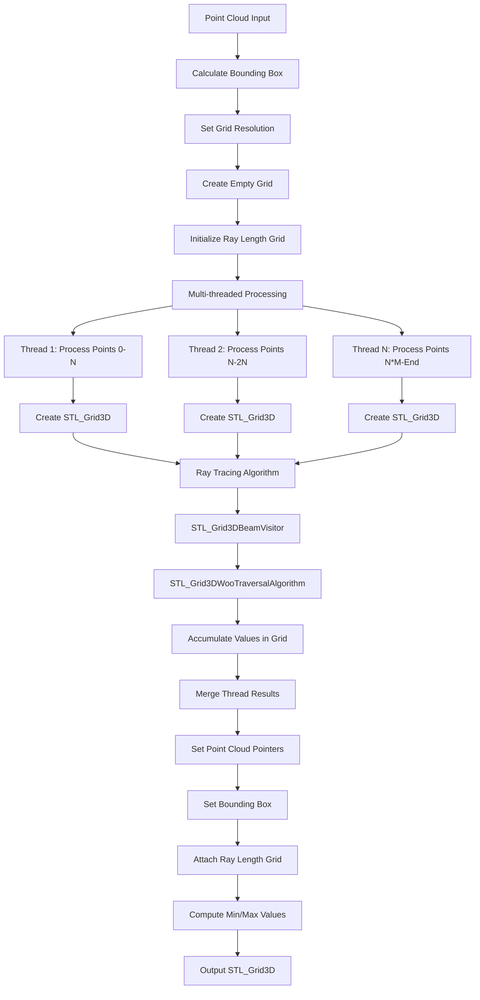
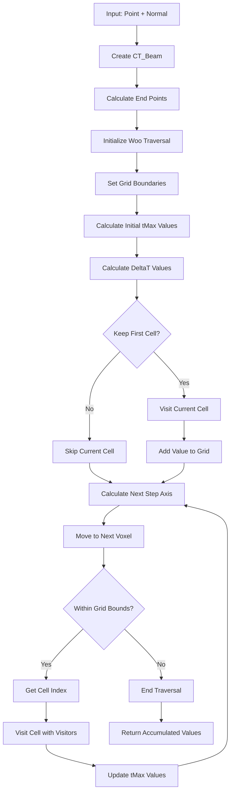
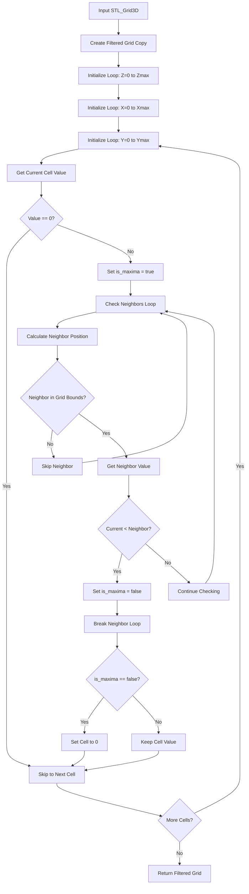
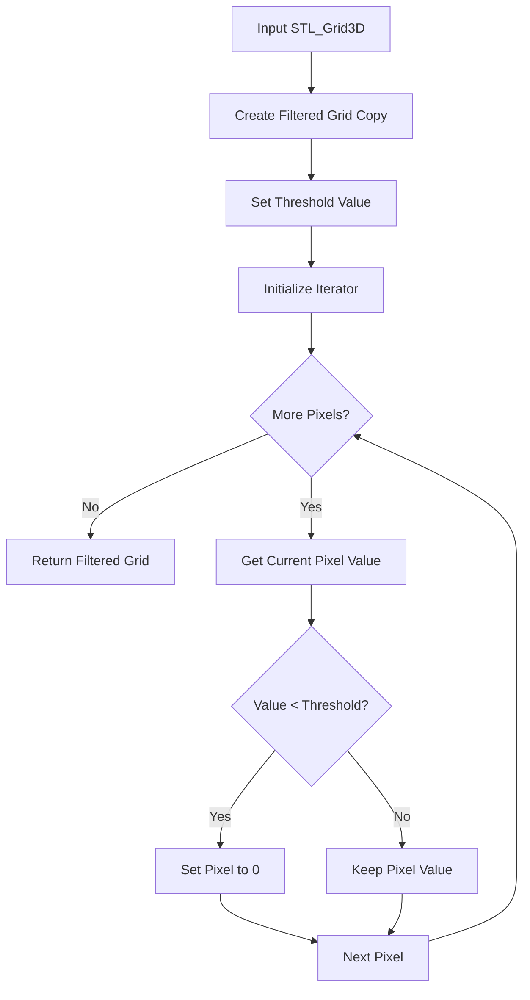
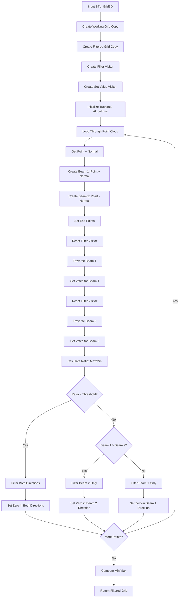
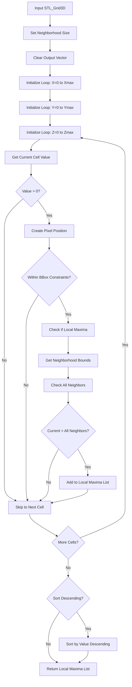
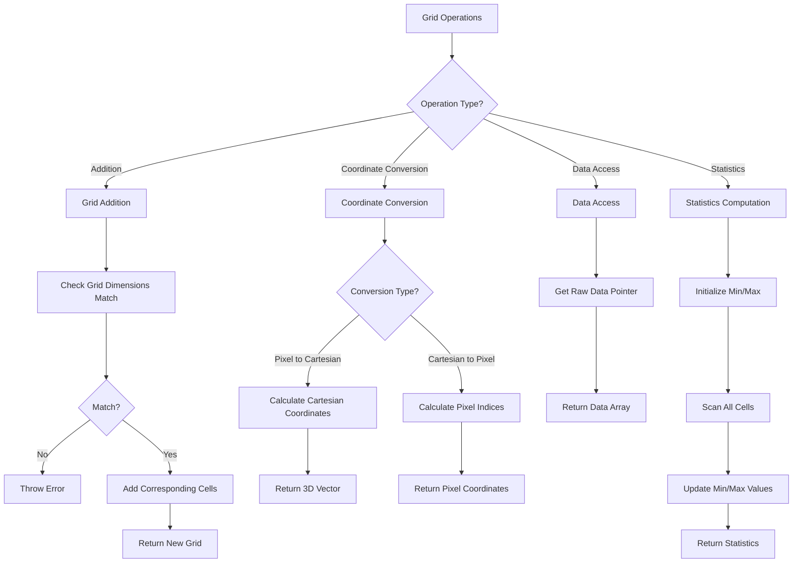
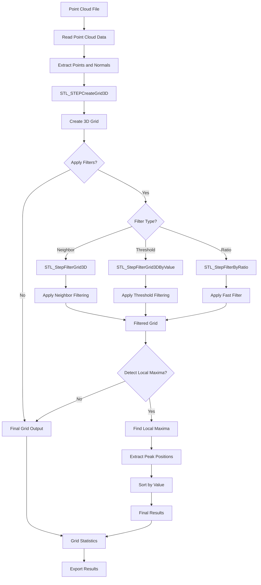
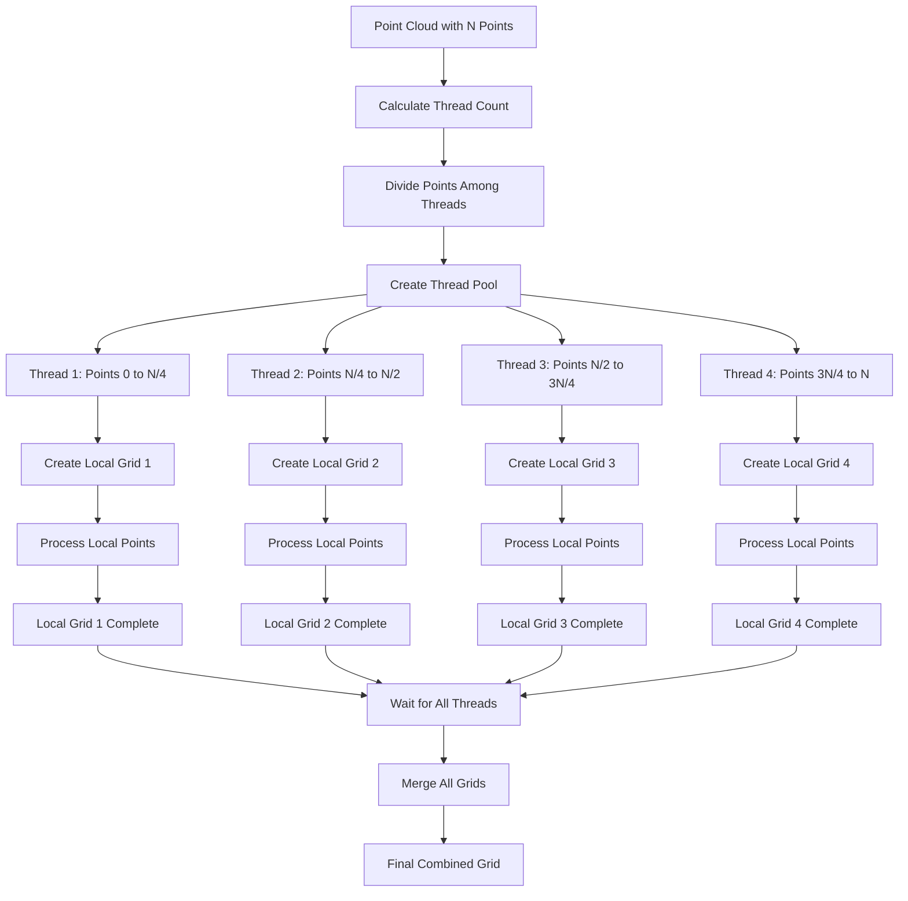

# STL_Grid3D Processing Workflows

This document contains Mermaid flowcharts explaining the various processing workflows for STL_Grid3D objects.

## 1. Main Grid Creation Workflow



## 2. Ray Tracing Algorithm Workflow



## 3. Grid Filtering Workflows

### 3.1 Neighbor-Based Filtering



### 3.2 Threshold-Based Filtering



### 3.3 Fast Filter with Ray Tracing



## 4. Local Maxima Detection Workflow



## 5. Grid Operations Workflow



## 6. Complete Processing Pipeline



## 7. Multi-threading in Grid Creation



## 8. Beam Visitor Pattern

```mermaid
flowchart TD
    A[Beam Creation] --> B[Initialize Visitor List]
    B --> C[Add STL_Grid3DBeamVisitor]
    C --> D[Add STL_VisitorGrid3DFastFilter]
    D --> E[Add STL_VisitorGrid3DSetValue]
    
    E --> F[Create Woo Traversal Algorithm]
    F --> G[Set Grid and Visitors]
    G --> H[Start Beam Traversal]
    
    H --> I[For Each Cell in Beam Path]
    I --> J[Call Visitor.visit(index, beam)]
    J --> K{Visitor Type?}
    
    K -->|BeamVisitor| L[Add Value to Grid]
    K -->|FastFilter| M[Accumulate Votes]
    K -->|SetValue| N[Set Specific Value]
    
    L --> O[Continue Traversal]
    M --> O
    N --> O
    
    O --> P{More Cells?}
    P -->|Yes| I
    P -->|No| Q[Traversal Complete]
    
    Q --> R[Get Visitor Results]
    R --> S[Process Results]
``` 